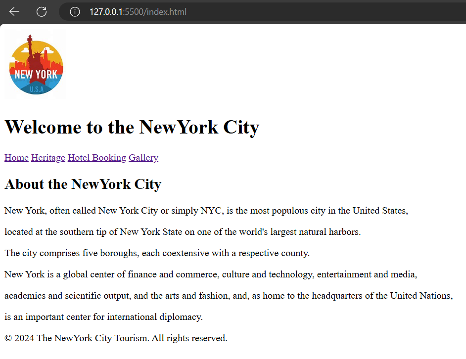
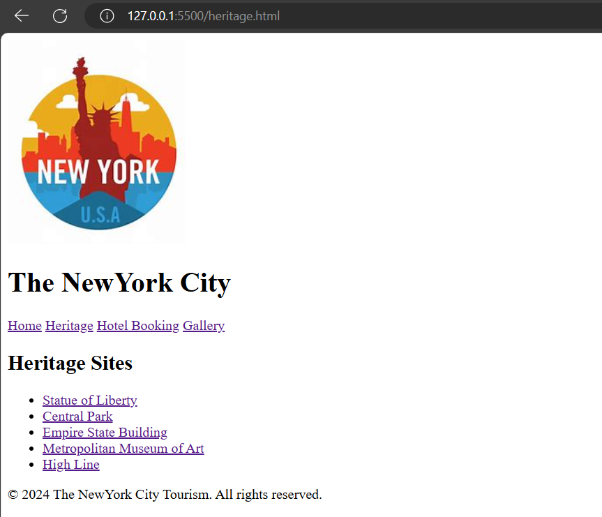
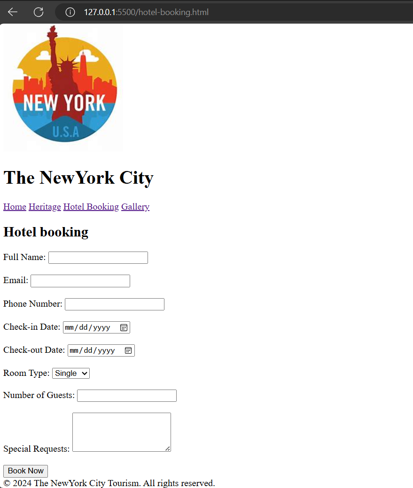
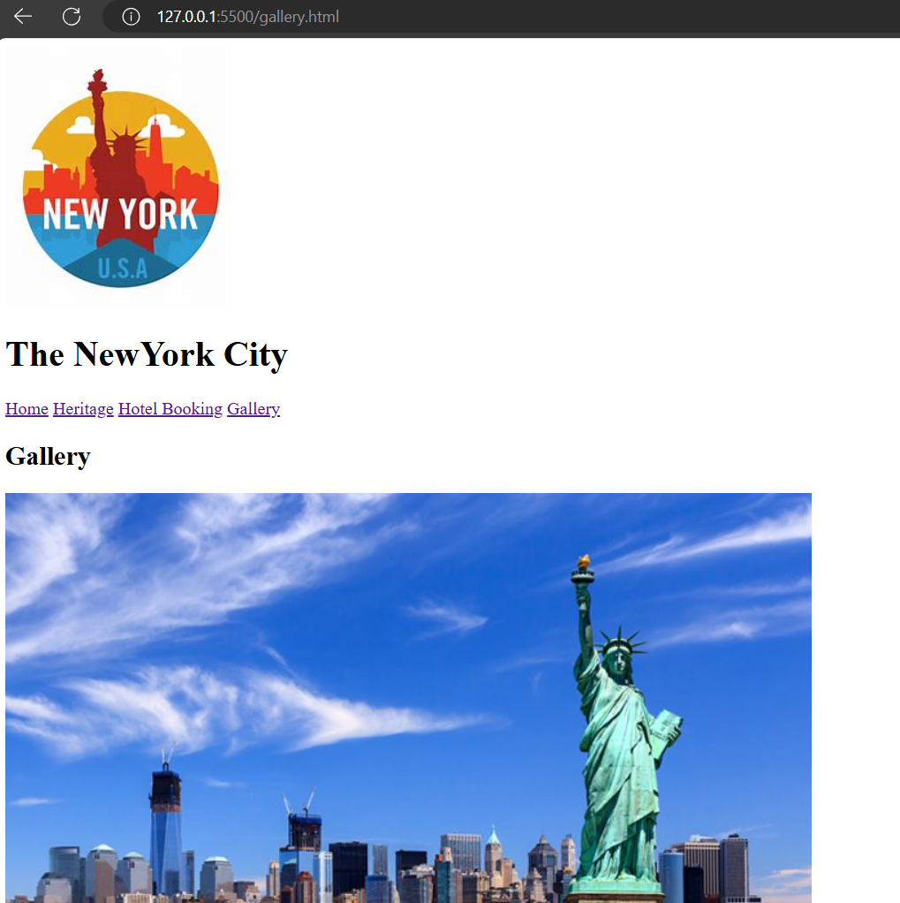

# html-city-tourism
## CODE:
### INDEX.html
```
<!DOCTYPE html>
<html lang="en">
<head>
    <meta charset="UTF-8">
    <meta name="viewport" content="width=device-width, initial-scale=1.0">
    <title>Welcome to the NewYork City</title>
    <link rel="stylesheet" href="css/styles.css">
</head>
<body>

<header>
    
    <h1>Welcome to the NewYork City</h1>
</header>

<nav>
    <a href="index.html">Home</a>
    <a href="heritage.html">Heritage</a>
    <a href="hotel-booking.html">Hotel Booking</a>
    <a href="gallery.html">Gallery</a>
</nav>

<div class="container">
    <h2>About the NewYork City</h2>
    <p>New York, often called New York City or simply NYC, is the most populous city in the United States,</p>
    <p>  located at the southern tip of New York State on one of the world's largest natural harbors. </p>
    <p>   The city comprises five boroughs, each coextensive with a respective county. </p>
    <p>   New York is a global center of finance and commerce, culture and technology, entertainment and media,</p> 
    <p>   academics and scientific output, and the arts and fashion, and, as home to the headquarters of the United Nations,</p>
    <p>   is an important center for international diplomacy.
    </p>
</div>

<footer>
    &copy; 2024 The NewYork City Tourism. All rights reserved.
</footer>

</body>
</html>
```
### heritage.html:
```
<!DOCTYPE html>
<html lang="en">
<head>
    <meta charset="UTF-8">
    <meta name="viewport" content="width=device-width, initial-scale=1.0">
    <title>Heritage Sites - The NewYork City</title>
    <link rel="stylesheet" href="css/styles.css">
</head>
<body>

<header>
    
    <h1>The NewYork City</h1>
</header>

<nav>
    <a href="index.html">Home</a>
    <a href="heritage.html">Heritage</a>
    <a href="hotel-booking.html">Hotel Booking</a>
    <a href="gallery.html">Gallery</a>
</nav>

<article>
    <h2>Heritage Sites</h2>
    <ul>
        <li><a href="heritage-sites/site1.html">Statue of Liberty</a></li>
        <li><a href="heritage-sites/site2.html">Central Park</a></li>
        <li><a href="heritage-sites/site3.html">Empire State Building</a></li>
        <li><a href="heritage-sites/site4.html">Metropolitan Museum of Art</a></li>
        <li><a href="heritage-sites/site5.html">High Line</a></li>
    </ul>
</div>

<footer>
    &copy; 2024 The NewYork City Tourism. All rights reserved.
</footer>

</body>
</html>
```
### hotel booking.html:
```
<!DOCTYPE html>
<html lang="en">
<head>
    <meta charset="UTF-8">
    <meta name="viewport" content="width=device-width, initial-scale=1.0">
    <title>Hotelbooking Sites - The NewYork City</title>
    <link rel="stylesheet" href="css/styles.css">
</head>
<body>

<header>
    
    <h1>The NewYork City</h1>
</header>

<nav>
    <a href="index.html">Home</a>
    <a href="heritage.html">Heritage</a>
    <a href="hotel-booking.html">Hotel Booking</a>
    <a href="gallery.html">Gallery</a>
</nav>

<article>
    <h2>Hotel booking</h2>
    <form action="/submit-booking" method="post">
        <label for="name">Full Name:</label>
        <input type="text" id="name" name="name" required><br><br>

        <label for="email">Email:</label>
        <input type="email" id="email" name="email" required><br><br>

        <label for="phone">Phone Number:</label>
        <input type="tel" id="phone" name="phone" required><br><br>

        <label for="checkin">Check-in Date:</label>
        <input type="date" id="checkin" name="checkin" required><br><br>

        <label for="checkout">Check-out Date:</label>
        <input type="date" id="checkout" name="checkout" required><br><br>

        <label for="roomtype">Room Type:</label>
        <select id="roomtype" name="roomtype" required>
            <option value="single">Single</option>
            <option value="double">Double</option>
            <option value="suite">Suite</option>
        </select><br><br>

        <label for="guests">Number of Guests:</label>
        <input type="number" id="guests" name="guests" required min="1"><br><br>

        <label for="requests">Special Requests:</label>
        <textarea id="requests" name="requests" rows="4"></textarea><br><br>

        <button type="submit">Book Now</button>
    </form>
</div>

<footer>
    &copy; 2024 The NewYork City Tourism. All rights reserved.
</footer>

</body>
</html>
```
### gallery.html:
```
<!DOCTYPE html>
<html lang="en">
<head>
    <meta charset="UTF-8">
    <meta name="viewport" content="width=device-width, initial-scale=1.0">
    <title>Gallery Sites - The NewYork City</title>
    <link rel="stylesheet" href="css/styles.css">
</head>
<body>

<header>
    
    <h1>The NewYork City</h1>
</header>

<nav>
    <a href="index.html">Home</a>
    <a href="heritage.html">Heritage</a>
    <a href="hotel-booking.html">Hotel Booking</a>
    <a href="gallery.html">Gallery</a>
</nav>

<article>
    <h2>Gallery</h2>
    
    
    
    
    
</div>

<footer>
    &copy; 2024 The NewYork City Tourism. All rights reserved.
</footer>

</body>
</html>
```
## OUTPUT:



